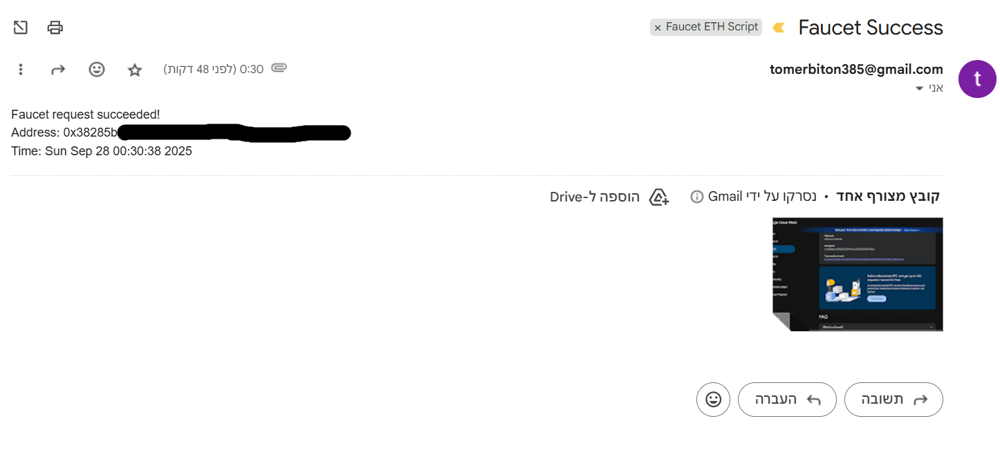
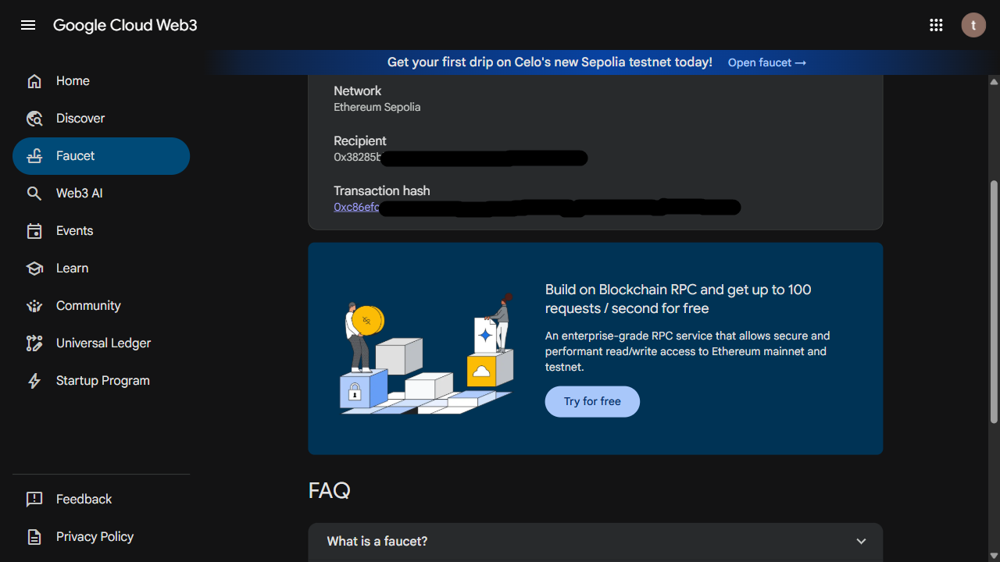

# 🚰 Ethereum Sepolia Faucet Automation

This project is an **automation script** that automatically requests test ETH from the official [Google Cloud Ethereum Sepolia Faucet](https://cloud.google.com/application/web3/faucet/ethereum/sepolia).  

Because faucets have a **24-hour cooldown**, this script is designed to run automatically (e.g., with **Windows Task Scheduler**) every day, request Sepolia ETH to your wallet, and send you a confirmation email (with a screenshot) about the result.

---

## ✨ Why I built this
When working with Ethereum smart contracts on **Sepolia Testnet**, you need **test ETH** to pay for gas fees.  
Google provides a faucet, but it:
- Requires you to be logged into a Google account.  
- Allows only **one request per day per account**.  
- Involves manual steps (login, select network, paste wallet address, click "Receive").  

I wanted a **fully automated solution**:
- Runs daily in the background.  
- Logs into Google if needed.  
- Selects the correct faucet network.  
- Submits my wallet address.  
- Clicks "Receive".  
- Detects if the transaction is pending, succeeded, or failed.  
- Sends me an email notification with a screenshot of the result.  

---

## 🔄 What the script does
1. Launches **Google Chrome** using [Playwright](https://playwright.dev/) with a **persistent profile** (`chrome-data/`).  
2. Opens the **Google Sepolia Faucet** page.  
3. Checks if you are logged into Google:  
   - If **not logged in**, waits until you sign in manually (or times out).  
   - Saves the Google session (`state.json`) for future runs.  
4. Selects **Ethereum Sepolia (0.05 ETH)** from the dropdown.  
5. Fills your **wallet address** (from `.env`).  
6. Clicks **"Receive Sepolia ETH"**.  
7. Detects faucet response:  
   - ⏳ *Pending* → keeps waiting.  
   - ✅ *Success* → logs success and saves screenshot.  
   - ❌ *Fail / Daily Limit* → logs error and saves screenshot.  
8. Sends an **email notification** with the log and screenshot attached.  
9. Closes the browser.  

---

## 🪙 What is an ETH faucet?
A **faucet** is a free service that distributes small amounts of test ETH for developers.  
- Used on **testnets** (like Sepolia) to simulate real transactions.  
- Necessary for deploying and testing smart contracts.  
- Google’s Sepolia faucet gives **0.05 ETH every 24 hours per Google account**.  

Without this automation, you’d have to request manually every day.  

---

## 🛠️ Technologies used
- **Python 3.11+**  
- **[Playwright](https://playwright.dev/python/)** → browser automation  
- **[python-dotenv](https://github.com/theskumar/python-dotenv)** → load secrets from `.env`  
- **smtplib (built-in)** → send email reports  
- **logging** → structured logging to console + `faucet.log`  
- **Windows Task Scheduler** → run script automatically every 24h  

---

## 📂 Project structure
```
eth-sepolia-faucet-automation/
│
├─ src/
│ ├─ main.py          # Entry point: runs the faucet automation
│ ├─ config.py        # Configuration and .env variables
│ ├─ utils.py         # Helpers: email, wait_for_status
│ └─ selectors.md     # Documentation of all Playwright selectors
│
├─ screenshots/       # Saved faucet result screenshots
├─ chrome-data/       # Persistent Chrome user profile (Google login saved)
├─ state.json         # Saved Playwright session state
├─ faucet.log         # Logs of all runs
│
├─ .env               # Your secrets (wallet address, email credentials)
├─ .gitignore         # Ignore sensitive/runtime files
├─ requirements.txt   # Python dependencies
├─ LICENSE            # Project license (e.g., MIT)
└─ README.md          # This documentation
```

---

## ⚙️ Setup & Installation

1. **Clone repository**  
   ```bash
   git clone https://github.com/TomerBitonn/ETH-Sepolia-Faucet-Automation.git
   cd ETH-Sepolia-Faucet-Automation
   ```

2. **Create virtual environment**
    ```bash
    python -m venv venv
    source venv/bin/activate   # Mac/Linux
    venv\Scripts\activate      # Windows
    ```

3. **Install dependencies**
    ```bash
    pip install -r requirements.txt
    playwright install chrome
    ```

4. **Set up `.env` file**
    ```bash
    TARGET_ADDRESS=0xYourWalletAddress
    SMTP_SERVER=smtp.gmail.com
    SMTP_PORT=587
    SMTP_USER=your_email@gmail.com
    SMTP_PASSWORD=your_app_password
    EMAIL_TO=your_email@gmail.com
    ```

---

## ▶️ Run the script manually
```bash
python src/main.py
```

If not logged into Google, the script will prompt you to log in manually once. 
After that, your session is saved (`state.json`) and reused automatically.

---

## ⏲️ Automation with Windows Task Scheduler

Since the faucet only works once every 24 hours, you can automate this script with Task Scheduler:

- Open Task Scheduler (search in Start menu).

- Click Create Basic Task → name it ETH Faucet Automation.

- Choose Daily trigger → every 24 hours.

- Action → Start a program.

- Program: path to your python.exe (inside your venv).

- Arguments: src\main.py

- Start in: project root folder.

- Save → Windows will now run the script daily.

---

## 📸 Example output




---

## 📜 License

MIT License. Free to use, share, and improve.
